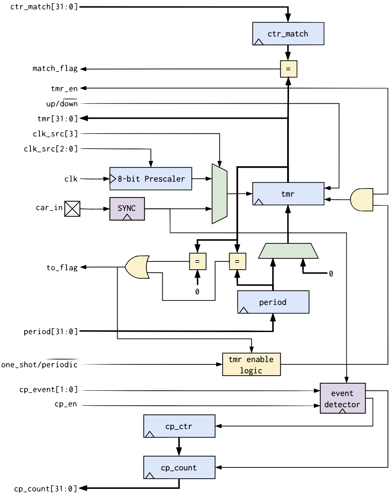

# EF_TCC32
A 32-bit Timer/Counter/Capture Soft IP in Verilog HDL. It has a generic bus interface compatible with wrapper_gen.py. Three bus wrappers are provided for: AHB-Lite, APB and WB. 

## Features
- Up/Down Counting
- One Shot or Periodic Timer
- External Events Capturing/Counting
- 8-bit Clock Prescaler (Timer only)
- 3 Interrupt sources
    - Timer Time-out
    - Counter Match
    - Event Capture

## The Interface
### EF_TCC32

| Port name  | Direction | Type   | Description |
| ---------- | --------- | ------ | ----------- |
| clk        | input     |        | Clock            |
| rst_n      | input     |        | Active low reset            |
| ctr_in     | input     |        | External events input            |
| period     | input     | [31:0] | 32-bit Timer Period             |
| ctr_match  | input     | [31:0] | 32-bit match value (counter mode)            |
| tmr        | output    | [31:0] | Current timer value            |
| cp_count   | output    | [31:0] | Current counter value            |
| clk_src    | input     | [3:0]  | clk source (9: ctr_in, 8: clk, 0-7: clk/2 to clk/256)            |
| to_flag    | output    |        | Time out flag             |
| match_flag | output    |        | Match flag            |
| tmr_en     | input     |        | Timer enable            |
| one_shot   | input     |        | One Shot mode enable (default: periodic)           |
| up         | input     |        | Up counting enable (default: down counting)            |
| cp_en      | input     |        | External events capturing enable            |
| cp_event   | input     | [1:0]  | External Event type (1: posedge, 2: negedge, 3: both)            |
| cp_flag    | output    |        | Capture event received flag           |
| en         | input     |        | Global enable            |

## EF_TMR32 Internals

## Modes of Operation
| mode | tmr_en | cp_en | clk_src| description |
|------|--------|-------|--------|-------------|
| Timer|1       |0      |0-8|Counts clock cycles to keep track of time.  - <b>clk_src</b> 8: clk, 0-7: clk/2 to clk/256  - <b>up</b>: 0: down counting (period to 0), 1: up counting (0 to period)  - <b>one_shot</b>: 0:periodic, 1:one shot - <b>period</b>: starting/terminal count for down/up counting. - <b>to_flag</b>: is set when the tmr reaches the terminal count (up:period, down:0)|
| Counter|1|0|9 | Similar to the Timer but it counts external pulses coming on <b>ctr_in</b>. <b>match_flag</b> is set when <b>tmr</b> matches <b>ctr_match</b>. The counting can be up/down and to/from <b>period</b> register|
|Event Capture|1|1|0-8|Capture the time between two events on <b>ctr_in</b>. <b>cp_event</b> sets the event: 1:Raising Edge, 2:Falling Edge or 3:Both. <b>cp_flag</b> is set when two two consecutive events are observed; once set, <b>cp_count</b> shows the current count.|

## I/O Registers
### Timer Value Register [offset: 0x00, RO]

### Timer Period Register [offset: 0x04, RW]

### PWM Compare Register [offset: 0x08, RW]

### Counter Match Register [offset: 0x0C, RW]

### Control Register [offset: 0x100, RW]

### Raw Interrupts Status Register [offset: 0xF00, RO]
Reflects the status of interrupts trigger conditions detected (raw, prior to masking). 
- to: Time-out Flag
- cp: Capture Flag
- match: Match Flag

### Masked Interrupts Status Register [offset: 0xF04, RO]
Similar to RIS but shows the state of the interrupt after masking. MIS register is always RIS & IM.

### Interrupts Mask Register [offset: 0xF08, RW]
Disabling/ENabling an interrupt source.

### Interrupt Clear Register [offset: 0xF0C, RW]
Writing a 1 to a bit in this register clears the corresponding interrupt state in the RIS Register. 

