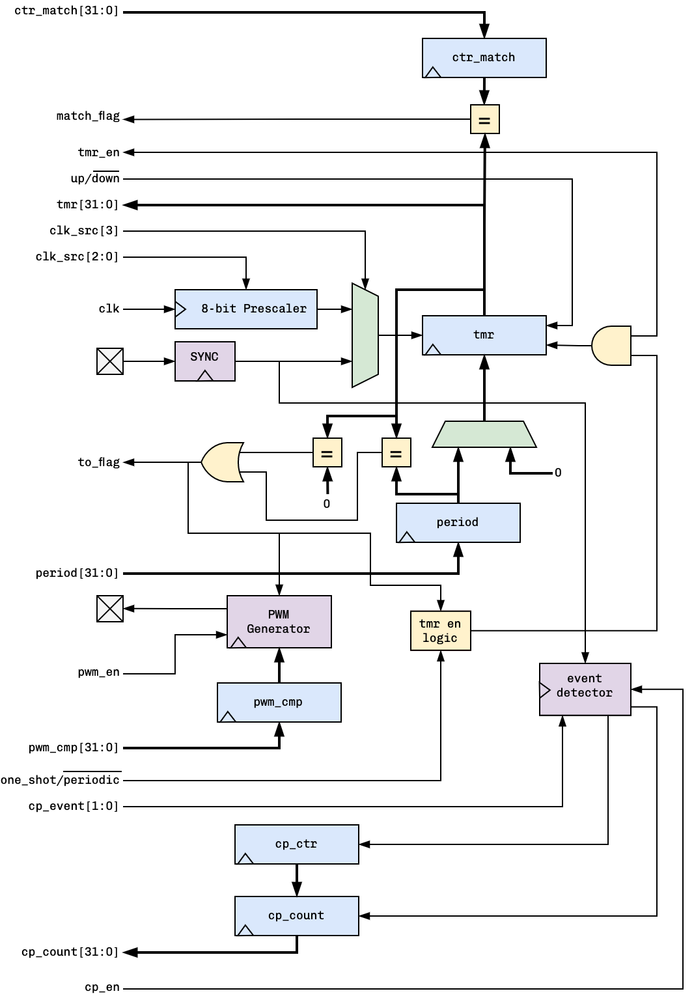

# ms_tmr32
A 32-bit Timer/Counter/Capture/PWM Soft IP in Verilog. It comes with a wrapper for the classical WB bus.

## Features
- Up/Down Counting
- One Shot or Periodic Timer
- PWM Generation
- External Events Capturing/Counting
- 8-bit Clock Prescaler
- 3 Interrupt sources

## The Interface
### ms_tmr32

| Port name  | Direction | Type   | Description |
| ---------- | --------- | ------ | ----------- |
| clk        | input     |        | Clock            |
| rst_n      | input     |        | Active low reset            |
| ctr_in     | input     |        | External events input            |
| pwm_out    | output    |        | PWM Out            |
| period     | input     | [31:0] | 32-bit Timer Period             |
| pwm_cmp    | input     | [31:0] | 32-bit PWM Compare Value            |
| ctr_match  | input     | [31:0] | 32-bit match value (counter mode)            |
| tmr        | output    | [31:0] | Current timer value            |
| cp_count   | output    | [31:0] | Current counter value            |
| clk_src    | input     | [3:0]  | clk source (9: ctr_in, 8: clk, 0-7: clk/2 to clk/256)            |
| to_flag    | output    |        | Time out flag             |
| match_flag | output    |        | Match flag            |
| tmr_en     | input     |        | Timer enable            |
| one_shot   | input     |        | One Shot mode enable (default: periodic)           |
| up         | input     |        | Up counting enable (default: down counting)            |
| pwm_en     | input     |        | PWM generator enable            |
| cp_en      | input     |        | External events capturing enable            |
| cp_event   | input     | [1:0]  | External Event type (1: posedge, 2: negedge, 3: both)            |
| cp_flag    | output    |        | Capture event received flag           |
| en         | input     |        | Global enable            |

### ms_tmr32_wb

| Port name | Direction | Type           | Description |
| --------- | --------- | -------------- | ----------- |
| clk_i     | input     | wire           |             |
| rst_i     | input     | wire           |             |
| adr_i     | input     | wire    [31:0] |             |
| dat_i     | input     | wire    [31:0] |             |
| dat_o     | output    | wire    [31:0] |             |
| sel_i     | input     | wire    [3:0]  |             |
| cyc_i     | input     | wire           |             |
| stb_i     | input     | wire           |             |
| ack_o     | output    |                |             |
| we_i      | input     | wire           |             |
| ctr_in    | input     | wire           | External events input            |
| pwm_out   | output    | wire           | PWM output            |
| irq       | output    | wire           | Interrupt ReQuest output            |

## ms_tmr32 Internals

## Modes of Operation
### Timer
### Counter
### Events Capture
### Pulse Width Modulation (PWM)
## Wishbone Registers
### Timer Value Register [offset: 0x00]
### Timer Period Register [offset: 0x04]
### PWM Compare Register [offset: 0x08]
### Counter Match Register [offset: 0x0C]
### Control Register [offset: 0x100]
### Raw Interrupts Status Register [offset: 0x200]
### Masked Interrupts Status Register [offset: 0x204]
### Interrupts Mask Register [offset: 0x208]
### Interrupt Clear Register [offset: 0x20c]
